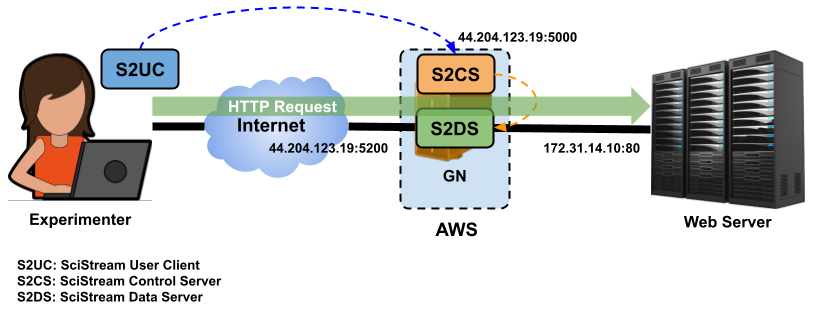
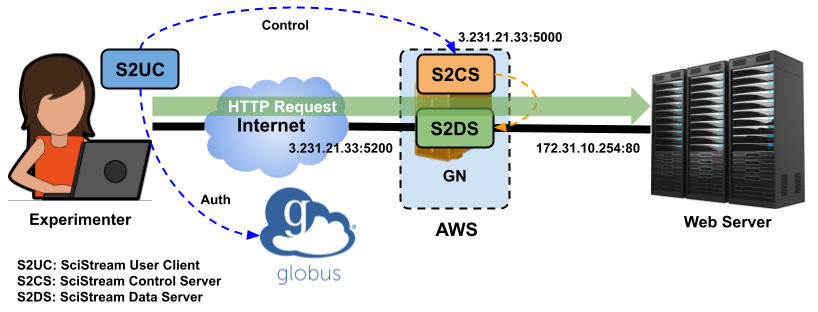
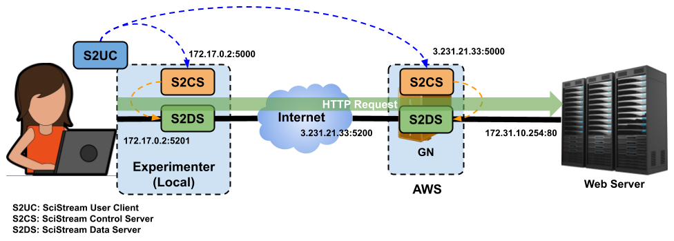

# SciStream SuperComputing 24 Hands-on Tutorial

This tutorial guides you through setting up and running SciStream using Docker containers. At the end of the tutorial you should be able to reach a streaming application hidden in a private network.

This tutorial has 2 parts, in the first part we focus on using the docker environment to use the Scistream CLI too to make a request to an existing Scistream Control Server setup at AWS.

In the second part we are going to setup our own Scistream Control Server at a local machine. Next, we are going to make a Scistream Client request towards the Scistream Control Server that we created. Finally we are going to stream data from the producer to the consumer.

## Table of Contents
- [Prerequisites](#prerequisites)
- [Installation Steps](#installation-steps)
- [Troubleshooting](#troubleshooting)

## Prerequisites

Before starting, make sure you have:
- Basic understanding of Docker
- Docker installed on your system ([Docker Installation Guide](https://docs.docker.com/engine/install/))
- OpenSSL for certificate generation
- Open ports: 22, 5000, 5074, 5080

| Host | Public IP | Private IP |
|----------|-----------|-----------|
| Scistream 1 | 44.204.123.19 | 172.31.14.10 |
| Scistream 2 | 44.205.7.224| 172.31.3.153 |
| Scistream 3 | 3.231.21.33 | 172.31.10.254 |

## Part 1: Connecting to AWS Control Server



### 1.1 Initial Setup

First, let's get the tutorial files and set up our environment:

```bash
# Clone the tutorial repository
git clone https://github.com/scistream/sc24-tutorial.git
cd sc24-tutorial
```

### 1.2 Pull the SciStream Docker image

```bash
docker pull castroflaviojr/scistream
```

Now let's start a scistream docker container with certificate volume mounted and access using it's backdoor by setting the entrypoint as /bin/bash.

```
docker run -it -v ./certificates:/scistream   --entrypoint /bin/bash castroflaviojr/scistream:latest
```

### 1.3 Run SciStream User Client (S2UC)

The goal for this part of the tutorial is to get the user started with the Scistream User Client. For this purpose we are going to make requests against a remote Scistream Control Server at AWS as demonstrated in figure 1 below. TODO figure 1

This is a client request for an inbound connection to a private server at ip address 172.31.92.192:

```bash
s2uc inbound-request \
    --server_cert="/scistream/server1.crt" \
    --remote_ip 172.31.3.153 \
    --s2cs 44.205.7.224:5000 \
    --receiver_ports 80 \
    --num_conn 1
```
Key components to note:
- Control Server Address: 44.205.7.224:5000
- Producer Application: 172.31.3.153:80
- Server certificate is required for secure communication

**Important Notes:**
- Requires public certificates for the SciStream control server
- Control server must be running
- This uses an unauthorized SciStream control server (no Globus Auth required)

Expected output:

```
sending client request message
started client request
waiting for hello message
sending for hello message
sending for hello message
Hello message sent successfully
listeners: "44.205.7.224:5200"
```
Now let's try accessing the resource.
```
curl 44.205.7.224:5200
```

### 1.4 Using Globus Authentication



At this second part of the tutorial our goal is to use S2UC with Globus Auth.

```bash
# First, logout of any existing sessions
s2uc logout
```
Login with Globus scope
```
s2uc login --scope "26c25f3c-c4b7-4107-8a25-df96898a24fe"
```
After you follow the instructions you should get a globus auth token.

Now let's make an authenticated request:
```
s2uc inbound-request \
    --server_cert="/scistream/server1.crt" \
    --remote_ip 172.31.3.153 \
    --s2cs 44.205.7.224:5001 \
    --receiver_ports 80 \
    --num_conn 1 \
    --scope 26c25f3c-c4b7-4107-8a25-df96898a24fe
```
To finish let's try accessing the new resource
```
wget 44.205.7.224:5200
```
### 1.5 Recap, first part

We have seen how we can make a scistream client request to open an inbound connection at a scistream control server at AWS forwarding the connection to a private streaming application(producer).

## Part 2 - Scistream Tutorial

Now we are going to learn how to configure the Scistream Control Server.

First, we are going to create a Scistream Control server and run it at your local machine. Next we'll make the inbound configuration of Scistream. This step will be similar to 1.3.

Then, we will use S2UC to configure it as a outbound proxy. This outbound proxy will establish a secure tunnel between your machine and a secure tunnel at a remote location. As described in figure 3 below.



### 2.1 Start docker container with appropriate port mappings


```
docker run -it -v ./certificates:/scistream -p 5000:5000 -p 5100-5110:5100-5110  --entrypoint /bin/bash castroflaviojr/scistream:latest
```

Our first challenge is identifying what is the reachable ip address of your docker installation.

This is important because we will need it to generate security certificates.

One way to do this is by running `ip address` from inside the docker container.

Note: Look for the eth0 interface IP (usually something like 172.17.0.2)

```
root@f7a58f9814d3:/# ip a
1: lo: <LOOPBACK,UP,LOWER_UP> mtu 65536 qdisc noqueue state UNKNOWN group default qlen 1000
    link/loopback 00:00:00:00:00:00 brd 00:00:00:00:00:00
    inet 127.0.0.1/8 scope host lo
       valid_lft forever preferred_lft forever
    inet6 ::1/128 scope host
       valid_lft forever preferred_lft forever
48: eth0@if49: <BROADCAST,MULTICAST,UP,LOWER_UP> mtu 1500 qdisc noqueue state UP group default
    link/ether 02:42:ac:11:00:02 brd ff:ff:ff:ff:ff:ff link-netnsid 0
    inet 172.17.0.2/16 brd 172.17.255.255 scope global eth0
       valid_lft forever preferred_lft forever
```

In this case the ip address is "172.17.0.2".

Also notice that we are mapping ports 5000 and port range 5100-5100 at the host to the container.

### 2.2 Certificate Generation

The next step is the public certificate generation.

```
cd scistream
openssl req -x509 -nodes -days 365 \
    -newkey rsa:2048 \
    -keyout server.key -out server.crt \
    -subj "/CN=172.17.0.2" \
    -addext "subjectAltName=IP:172.17.0.2"
```

Notice that this assumes that in your docker setup the ip address 172.17.0.2 is locally reachable. You might need to replace this with your locally reachable ip address.

The most common issue we face at this step of the tutorial is this ip address not being reachable.

### 2.3. Run Local SciStream Control Server

Now you are going to run the Scistream Control Server

```bash
    s2cs \
    --server_crt="/scistream/server.crt" \
    --server_key="/scistream/server.key" \
    --type="StunnelSubprocess" \
    --verbose \
    --listener_ip=172.17.0.2
```

### 2.4 Configure Inbound Proxy

Let's open a new terminal and start the S2UC container:

```
docker run -it -v ./certificates:/scistream   --entrypoint /bin/bash castroflaviojr/scistream:latest
```

First we will make a S2UC command to the remote control server:

```
s2uc inbound-request \
    --server_cert="/scistream/server1.crt" \
    --remote_ip 172.31.3.153 \
    --s2cs 44.205.7.224:5002 \
    --receiver_ports 80 \
    --num_conn 1
```
You should see an output like this:

### 2.5 Configure Outbound Proxy

Run SciStream User Client for outbound configuration:

```bash
s2uc \
    outbound-request \
    --server_cert="/scistream/server.crt" \
    --remote_ip 44.205.7.224 \
    --s2cs 172.17.0.2:5000 \
    --receiver_ports 5201 \
    --num_conn 1 \
    b6ed52b6-a3a9-11ef-946b-0242ac110003 44.205.7.224:5201
```
Notice that here the receiver port as well as the preshared key are important.

## Troubleshooting

To access a running container's terminal:
```bash
docker exec -it <container_id> /bin/bash
```

Common issues:
- Unreachable IP addresses: Make sure your container's IP is correctly specified in certificates
- Port conflicts: Ensure required ports are available and properly mapped
- Certificate errors: Double-check certificate paths and IP addresses match

Need help? Feel free reach out to the SciStream support team by creating a Github Issue!
